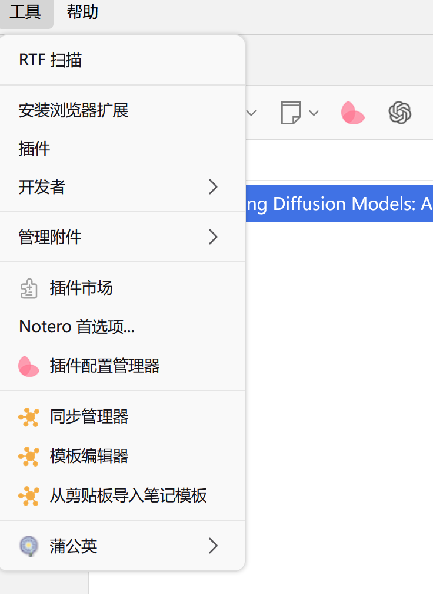
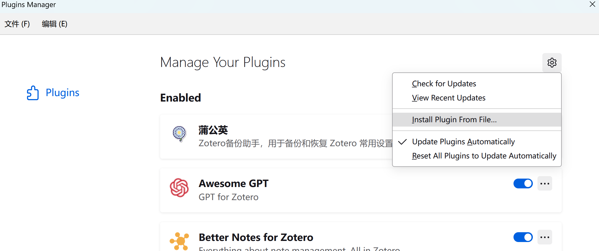
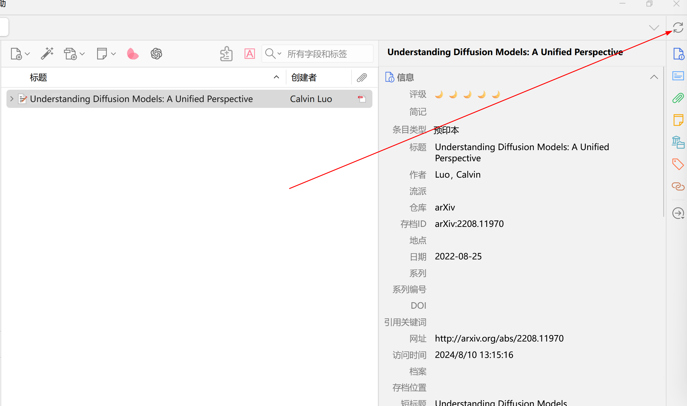
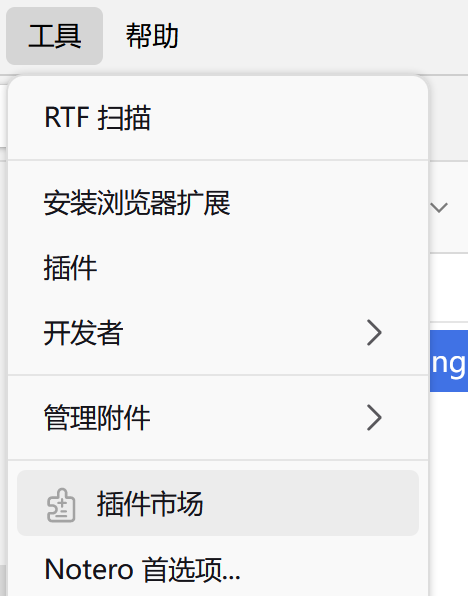
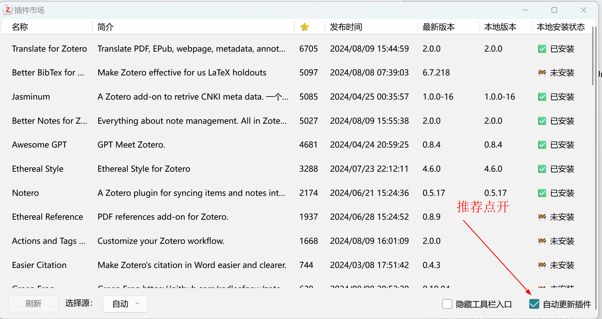
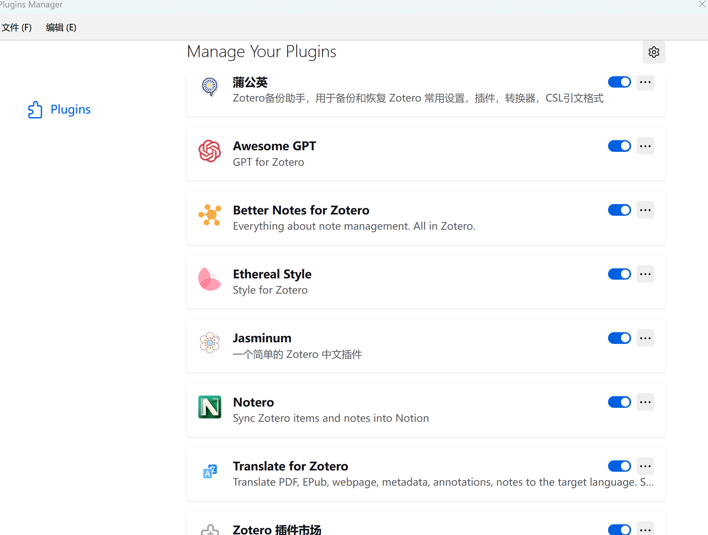
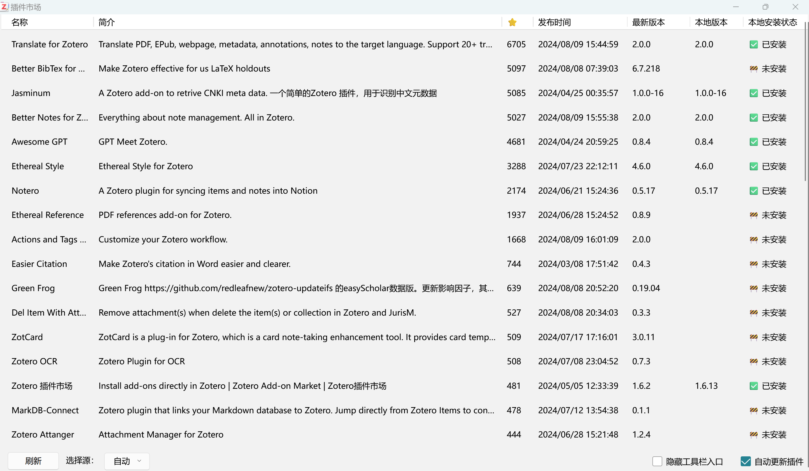
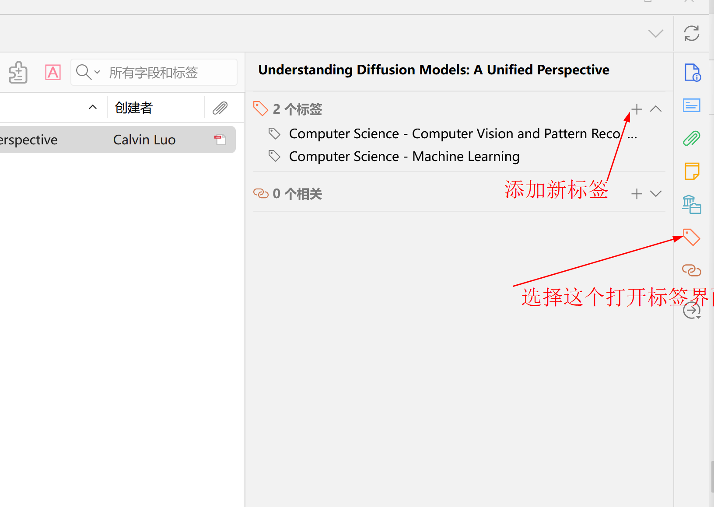
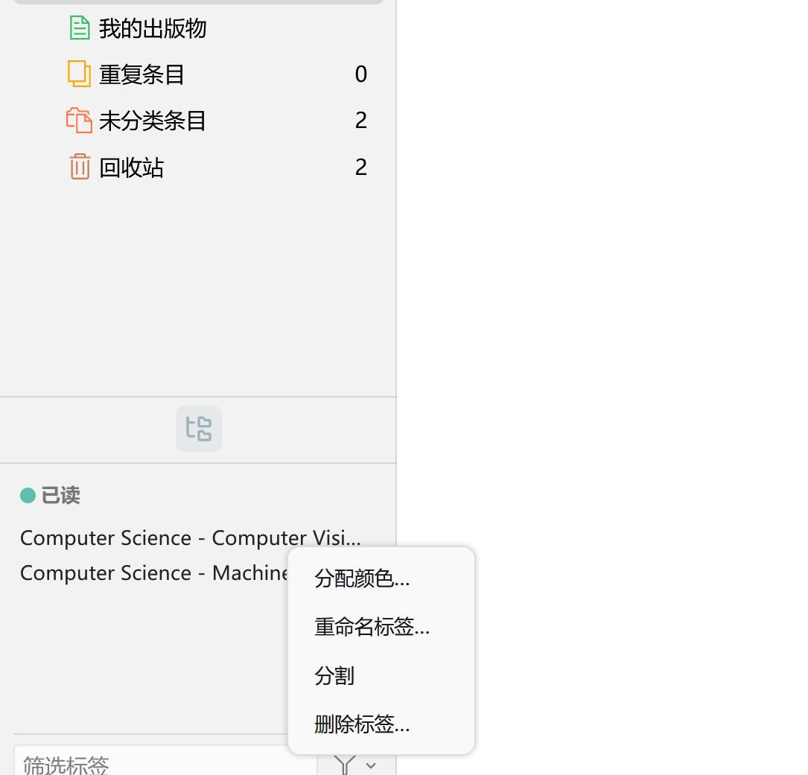
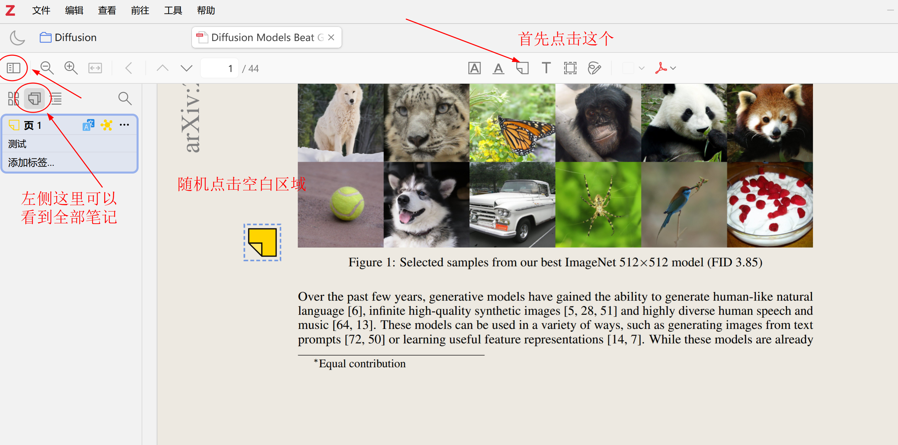

# easy-zotero

困于很多地方动则需要关注，或者评论私聊，实在是忍不住决定自己写一个一分钟即可上手的 zotero7 最新最佳指南。

本文适配最新 Zotero7 版本。

## Reference

- zotero 中文社区 https://zotero-chinese.com/
- zotero 官方网址 https://www.zotero.org/
- zotero 常见操作合集 https://main--zotero-zh.netlify.app/user-guide/quick-start.html

## 安装

### 1. 安装 Zotero7

目前已经更新到最新版本，你也可以在官网下载旧版本 Other versions

在网址找到下载地址 https://www.zotero.org/downloads 并安装桌面版。同时也推荐你可以安装一个 Connector，这可以方便你把想要归档的网页和pdf都送到 Zotero。

安装完毕后，我们需要进行插件管理器的安装（你可以在上面搜到所有开源插件）

https://github.com/syt2/zotero-addons/releases/

https://github.com/syt2/zotero-addons/releases/download/V1.6.13/--msg-name--.xpi

下载完毕后，我们需要如下操作安装插件管理器，点开工具，找到插件选项

点击插件后，进入插件安装界面：

点击右上角齿轮，然后找到 install plugin from file 的选项，单机后，找到刚才下载的 --msg-name--.xpi 为名字的 插件管理器（取决于你下载最新的版本的名字叫啥）

此时我们已经准备完毕。

### 2. 同步

我们可以使用 Zotero 自带同步功能，也可以使用其他软件进行同步。使用坚果云是比较多的方案，但建议你先用官方的同步，右上角有同步按钮可选，登陆后即可开启自带的免费同步，最低 300M， 超过后收费但是一年一百多，也算是支持 zotero了。

### 3. 插件安装

接下来我们开始常见插件的安装，在上一步中我们已经安装了插件管理器：

点击进入后，你可以看到很多琳琅满目的插件待你安装。

此时你只要根据这个图找名字 一个个安装插件即可。

不过，再花里胡哨的插件都不如认真阅读论文。。至此，我们准备好了全部环境。

## 使用 

### 1. 导入文献

我们可以通过两种方式导入，第一个是直接把PDF之类的拖进去，他会自动读取信息；另一种方式是利用 zotero 的chrome等浏览器插件将对应 paper 保存到 zotero 中。

### 2. pdf阅读

通过刚才的插件安装，我们支持很强大的pdf阅读，双击论文进入到pdf界面，我们发现此时已经支持了划词翻译

### 3. 标题、摘要翻译

我们可以右键一个 paper，找到摘要翻译，稍等片刻后翻译结果会出现在  extra 栏中。

### 3. 已读标签管理

我们可以通过已读标签管理，对论文进行分类，方便查找。首先我们需要按照如下方式添加新标签：

添加完成后，我们需要左下角找到这个图标，点击后可以右键一个标签，然后选择重命名改成 `已读` ，然后再选择分配颜色，此时默认用这个颜色表示这个标签，默认快捷键从1开始；设置完毕后，点击选中一个paper，按下1就会发现前面多了个对应颜色的圈圈；同时这个操作可以多选pdf然后按下对应快捷键批量操作，强烈推荐可以尝试。

### 4. 笔记

无论是阅读网页（右键-快照浏览），还是阅读pdf，我们都可以给具体段落添加学习笔记，之后在左侧栏可以很容易看到：

## 结束

以上就是 zotero 安装和使用的全部过程，希望对你有帮助，有问题欢迎 issue；更欢迎 PR 以及 star，谢谢。